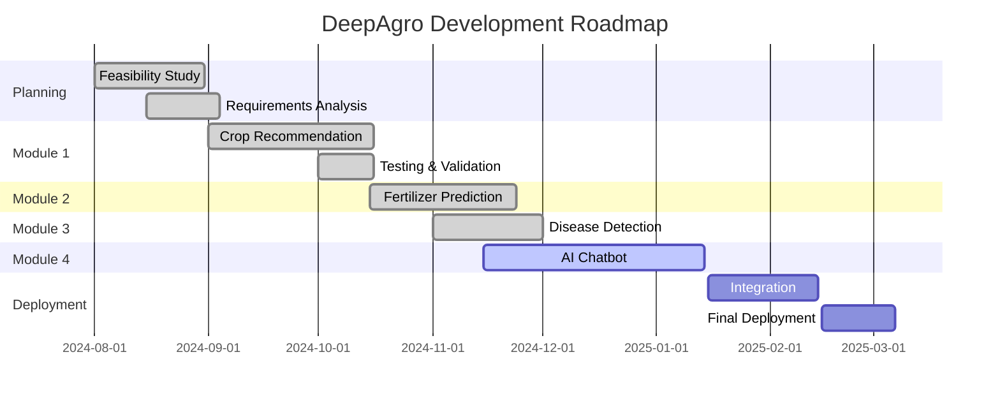

<div align="center">

# 🌾 DeepAgro 🌾

### *Smart Agriculture Powered by Artificial Intelligence*

[](https://www.python.org/)
[](https://www.tensorflow.org/)
[](https://github.com)

**CS210 Software Engineering Project**  
*Under the guidance of **Dr. Priodyuti Pradhan***  
**IIIT Raichur**

---


</div>

---

## 🌟 About DeepAgro

<div align="center">
<table>
<tr>
<td width="50%">

**DeepAgro** is a revolutionary **AI-powered agriculture platform** that bridges the gap between traditional farming and modern technology. Our mission is to empower farmers with intelligent, data-driven insights to maximize crop yield, minimize losses, and promote sustainable farming practices.

By leveraging cutting-edge **Machine Learning algorithms** and **Computer Vision**, we're transforming agriculture into a smart, efficient, and profitable industry.

</td>
<td width="50%">

```
🎯 Vision: Smart Farming for Everyone
🌱 Mission: AI-Driven Agricultural Success
💡 Goal: Sustainable & Profitable Farming
🚀 Impact: Transforming Lives of Farmers
```

</td>
</tr>
</table>
</div>

---

## 🎯 Project Modules

<div align="center">

| Module | Description | Status | Technology |
|:------:|:------------|:------:|:----------:|
| 🌾 | **Crop Recommendation System**<br/>*Intelligent crop suggestions based on soil & climate* | ✅ Complete | XGBoost, ML |
| 🧪 | **Fertilizer Prediction**<br/>*Optimal fertilizer recommendation system* | ✅ Complete | Random Forest |
| 🍃 | **Leaf Disease Detection**<br/>*Early disease identification using image recognition* | ✅ Complete | CNN, CV |
| 🤖 | **AI Farmer Assistant**<br/>*Smart chatbot for real-time farming queries* | 🔄 In Development | NLP, LLM |

</div>

---

## 🛠️ Technology Stack

<div align="center">

### Programming & Frameworks


### Machine Learning & AI


### Development & Deployment


</div>

---

## 📈 Project Development Timeline

<div align="center">



</div>

| Phase | Module | Status | Timeline |
|:-----:|:-------|:------:|:--------:|
| ✅ | Requirements & Feasibility Analysis | **Completed** | Aug 2024 |
| ✅ | Module 1: Crop Recommendation System | **Completed** | Sep-Oct 2024 |
| ✅ | Module 2: Fertilizer Prediction | **Completed** | Oct-Nov 2024 |
| ✅| Module 3: Leaf Disease Detection |  **Completed**  | Nov 2024 |
| 🔄 | Module 4: AI Farmer Assistant | **In Development** | Nov 2024-Jan 2025 |
| ⏳ | Integration & Final Deployment | Planned | Jan-Feb 2025 |

---

## 📚 Project Documentation

<div align="center">

| Document | Description | Link |
|:---------|:------------|:----:|
| 📋 Feasibility Report | Complete project feasibility analysis | [View](https://drive.google.com/drive/folders/1d_iCbjAw_72OWou1FsPdBFdg2EcPSrTW) |
| 📊 Requirements Specification | Detailed system requirements | [View](https://drive.google.com/drive/folders/1d_iCbjAw_72OWou1FsPdBFdg2EcPSrTW) |

</div>

---

## ⚙️ Software Engineering Methodology

<div align="center">

### 🔄 We Follow Agile Development

<table>
<tr>
<td width="25%" align="center">

#### 🎯
**Sprint Planning**
2-week sprints with clear goals

</td>
<td width="25%" align="center">

#### 🔄
**Iterative Development**
Continuous improvement cycles

</td>
<td width="25%" align="center">

#### 🤝
**Team Collaboration**
Daily standups & reviews

</td>
<td width="25%" align="center">

#### 📊
**Adaptive Planning**
Flexibility based on feedback

</td>
</tr>
</table>

**Why Agile?**  
✅ Iterative progress with regular deliverables  
✅ Adaptability to changing requirements  
✅ Continuous feedback and improvement  
✅ Enhanced team collaboration  
✅ Risk mitigation through incremental development

</div>

---

## 👥 Meet Our Team

<div align="center">

### **🌟 Team DeepAgro 🌟**

<table>
<tr>
<td align="center" width="16.66%">
<br />
<sub><b>Aditya Upendra Gupta</b></sub><br />
<sub>AD24B1003</sub><br />
🎯 Project Lead
</td>
<td align="center" width="16.66%">
<br />
<sub><b>Aaditya Awasthi</b></sub><br />
<sub>CS24B1001</sub><br />
💻 ML Engineer
</td>
<td align="center" width="16.66%">
<br />
<sub><b>Aditya Raj</b></sub><br />
<sub>CS24B1004</sub><br />
🧠 AI Specialist
</td>
<td align="center" width="16.66%">
<br />
<sub><b>Sudhavalli Murali</b></sub><br />
<sub>CS24B1057</sub><br />
📊 Data Analyst
</td>
<td align="center" width="16.66%">
<br />
<sub><b>Kinshu Keshri</b></sub><br />
<sub>AD24B1034</sub><br />
🎨 UI/UX Designer
</td>
<td align="center" width="16.66%">
<br />
<sub><b>Rishita</b></sub><br />
<sub>CS24B1021</sub><br />
🔧 Backend Developer
</td>
</tr>
</table>

</div>

---

## 🎓 Academic Information

<div align="center">

**Course:** CS210 - Software Engineering  
**Institution:** Indian Institute of Information Technology, Raichur  
**Mentor:** Dr. Priodyuti Pradhan  
**Academic Year:** 2024-2025

</div>

---

<div align="center">
  <h1>🌾 Module 1: Crop Recommendation System</h1>

  
  
  
</div>

### 📖 Overview

Our **Crop Recommendation System** is an intelligent ML-powered solution that analyzes soil nutrients, environmental conditions, and climate data to suggest the **most suitable crops** for cultivation. The system doesn't just recommend one crop—it provides the **top 3 best options**, giving farmers flexibility in their decision-making process.

<details>
<summary><b>🔍 Click to see Key Features</b></summary>

<br/>

- ✅ **Multi-Crop Recommendations** - Get top 3 crop suggestions with confidence scores
- 📊 **Comprehensive Analysis** - Detailed summary of your soil and environmental parameters
- ⚠️ **Smart Validation** - Intelligent warnings for unusual or outlier input values
- 🎯 **High Accuracy** - 99.3% accuracy using advanced XGBoost algorithm
- 🌍 **Real-World Data** - Trained on authentic agricultural datasets from Kaggle
- ⚡ **Fast Predictions** - Get results in milliseconds

</details>

---

### 📁 Dataset Information

<div align="center">

**Source:** [Kaggle Crop Recommendation Dataset](https://www.kaggle.com/datasets/atharvaingle/crop-recommendation-dataset)  
**Size:** 2,200+ samples | **Features:** 7 parameters | **Crops:** 22 varieties

</div>

### 📊 Input Features

<div align="center">

| 🔬 Feature | 📝 Description | 📏 Unit | 📈 Typical Range |
|:----------:|:---------------|:-------:|:----------------:|
| **N** | Nitrogen content in soil | kg/ha | 0 - 140 |
| **P** | Phosphorus content in soil | kg/ha | 5 - 145 |
| **K** | Potassium content in soil | kg/ha | 5 - 205 |
| **🌡️ Temperature** | Average atmospheric temperature | °C | 8 - 44 |
| **💧 Humidity** | Relative humidity percentage | % | 14 - 100 |
| **⚗️ pH** | Soil pH value (acidity/alkalinity) | - | 3.5 - 9.9 |
| **🌧️ Rainfall** | Annual rainfall | mm | 20 - 300 |

</div>

---

### 🤖 Machine Learning Models Comparison

We rigorously tested **5 different ML algorithms** to ensure the best performance:

<div align="center">

| 🏆 Rank | Model | Accuracy | Performance | Status |
|:-------:|:------|:--------:|:-----------:|:------:|
| **#1** | **XGBoost** | **99.3%** | ⭐⭐⭐⭐⭐ | ✅ **SELECTED** |
| #2 | Decision Tree | 98.1% | ⭐⭐⭐⭐ | - |
| #3 | Support Vector Machine | 97.8% | ⭐⭐⭐⭐ | - |
| #4 | K-Nearest Neighbors | 97.3% | ⭐⭐⭐ | - |
| #5 | Logistic Regression | 95.2% | ⭐⭐⭐ | - |

</div>

> 💡 **Why XGBoost?**  
> XGBoost (Extreme Gradient Boosting) demonstrated **superior performance** with 99.3% accuracy, excellent handling of non-linear relationships, and robust performance on agricultural data. Its ensemble learning approach makes it ideal for complex multi-class classification tasks.

---

### ✨ System Capabilities

<table>
<tr>
<td width="33%" align="center">

#### 🏆 Top 3 Recommendations

Get the **best 3 crop options** ranked by suitability score

Provides flexibility and alternatives for farmers

</td>
<td width="33%" align="center">

#### 📋 Input Summary

Comprehensive analysis of all input parameters

Helps understand farmland conditions

</td>
<td width="33%" align="center">

#### ⚠️ Smart Warnings

Intelligent outlier detection

Validates data accuracy automatically

</td>
</tr>
</table>

---

### 🚨 Intelligent Warning System

Our system includes **smart validation** to detect unusual values and alert users:

<div align="center">

| ⚠️ Warning Type | Condition | Alert Message |
|:----------------|:----------|:--------------|
| 🔴 **Critical pH** | pH < 3.5 or pH > 10 | "Warning! pH value is extremely unusual. Please verify your soil test." |
| 🔴 **Invalid Values** | Any negative value | "Invalid input detected. Please enter positive values for nutrients." |
| 🟡 **Temperature** | < 5°C or > 50°C | "Temperature value seems unusual for agricultural land." |
| 🟡 **Humidity** | < 0% or > 100% | "Humidity percentage should be between 0-100%." |
| 🟡 **Extreme Nutrients** | Values beyond typical range | "Nutrient levels are unusually high/low. Please verify soil test results." |

</div>

---

### 🎯 Sample Output

```
╔════════════════════════════════════════════════════════════╗
║          🌾 CROP RECOMMENDATION RESULTS 🌾                 ║
╚════════════════════════════════════════════════════════════╝

🏆 Top 3 Recommended Crops:
━━━━━━━━━━━━━━━━━━━━━━━━━━━━━━━━━━━━━━━━━━━━━━━━━━━━━━━━━━━
   1. 🌾 Rice                    Confidence: 94% ⭐⭐⭐⭐⭐
   2. 🌿 Cotton                  Confidence: 88% ⭐⭐⭐⭐
   3. 🌽 Maize                   Confidence: 82% ⭐⭐⭐⭐
━━━━━━━━━━━━━━━━━━━━━━━━━━━━━━━━━━━━━━━━━━━━━━━━━━━━━━━━━━━

📊 Your Input Summary:
━━━━━━━━━━━━━━━━━━━━━━━━━━━━━━━━━━━━━━━━━━━━━━━━━━━━━━━━━━━
   🔬 Nitrogen (N):              85 kg/ha
   🔬 Phosphorus (P):            58 kg/ha
   🔬 Potassium (K):             41 kg/ha
   🌡️  Temperature:              28°C
   💧 Humidity:                  75%
   ⚗️  pH Level:                  6.5 (Neutral)
   🌧️  Rainfall:                 180 mm
━━━━━━━━━━━━━━━━━━━━━━━━━━━━━━━━━━━━━━━━━━━━━━━━━━━━━━━━━━━

✅ All parameters are within normal range!
🌱 Your soil conditions are optimal for cultivation.

╔════════════════════════════════════════════════════════════╗
║  💡 Recommendation: Rice is highly suitable for your soil  ║
╚════════════════════════════════════════════════════════════╝
```

---

<div align='center'>
    
<h1> 🧪 Module 2: Fertilizer Prediction System </h1>


</div>

### 📖 Overview

The **Fertilizer Prediction System** is an intelligent recommendation engine that suggests the most suitable fertilizer type based on soil composition, crop type, and environmental factors. This helps farmers optimize fertilizer usage, reduce costs, and improve soil health.

---

### 🔍 Key Features

<table>
<tr>
<td width="33%" align="center">

#### 🎯 Precise Recommendations

Suggests optimal fertilizer type for your soil and crop combination

</td>
<td width="33%" align="center">

#### 📊 Multi-Factor Analysis

Considers soil nutrients, moisture, crop type, and temperature

</td>
<td width="33%" align="center">

#### 💰 Cost Optimization

Helps reduce unnecessary fertilizer expenses

</td>
</tr>
</table>

---

### 📊 Fertilizer Types Supported

<div align="center">

| Fertilizer Type | Primary Nutrients | Best For |
|:----------------|:------------------|:---------|
| **Urea** | High Nitrogen | Leafy crops, rapid growth |
| **DAP** | Nitrogen + Phosphorus | Root development |
| **14-35-14** | Balanced NPK | General purpose |
| **28-28** | Equal N-P | Vegetative growth |
| **17-17-17** | Balanced NPK | All-purpose |
| **20-20** | Equal N-P | General application |
| **10-26-26** | Low N, High P-K | Flowering & fruiting |

</div>

---

### 🎯 Input Parameters

<div align="center">

🌡️ **Temperature** • 💧 **Humidity** • 💦 **Moisture** • 🌾 **Crop Type** • 🔬 **N, P, K Levels** • ⚗️ **pH Value**

</div>

---

<div align="center">

<h1>🍃 Module 3: Leaf Disease Detection </h1>


</div>

### 📖 Overview

Our **Leaf Disease Detection System** uses advanced **Convolutional Neural Networks (CNN)** to identify plant diseases from leaf images. Trained on a massive dataset of **87,000+ images**, this system can detect multiple diseases across various crops with high accuracy.

---

### 🎯 Key Capabilities

<table>
<tr>
<td width="25%" align="center">

#### 📸 Image Recognition

Upload leaf photos for instant analysis

</td>
<td width="25%" align="center">

#### 🔍 Multi-Disease Detection

Identifies 38+ different plant diseases

</td>
<td width="25%" align="center">

#### ⚡ Real-Time Results

Get diagnosis in seconds

</td>
<td width="25%" align="center">

#### 💡 Treatment Suggestions

Provides remedies and prevention tips

</td>
</tr>
</table>

---

### 🤖 Deep Learning Architecture

```
Input Layer (224x224x3)
    ↓
Conv2D + MaxPooling (Multiple Layers)
    ↓
Batch Normalization
    ↓
Dropout Layers (Regularization)
    ↓
Fully Connected Layers
    ↓
Output Layer (38 Disease Classes)
```

---

### 📊 Model Performance

<div align="center">

| Metric | Score | Description |
|:-------|:-----:|:------------|
| **Training Accuracy** | 97.2% | Performance on training data |
| **Validation Accuracy** | 95.8% | Performance on validation data |
| **Test Accuracy** | 95.4% | Real-world performance |
| **Precision** | 95.6% | Accuracy of positive predictions |
| **Recall** | 94.9% | Detection rate of actual diseases |
| **F1-Score** | 95.2% | Harmonic mean of precision and recall |

</div>

---

### 🌱 Crops & Diseases Coverage

<div align="center">

<table>
<tr>
<td width="50%">

#### 🌾 Supported Crops (10+)

🍅 **Tomato** (10 diseases)  
🌽 **Corn** (4 diseases)  
🥔 **Potato** (3 diseases)  
🍃 **Pepper** (2 diseases)  
🍇 **Grape** (4 diseases)  
🍎 **Apple** (4 diseases)  
*...and more*

</td>
<td width="50%">

#### 🦠 Disease Detection (38+)

✓ Early & Late Blight  
✓ Bacterial Spot  
✓ Leaf Mold  
✓ Septoria Leaf Spot  
✓ Spider Mites  
✓ Target Spot  
✓ Yellow Leaf Curl Virus  
✓ Mosaic Virus  
✓ Healthy Detection

</td>
</tr>
</table>

</div>

---

### 📁 Dataset Information

<div align="center">

**Training Images:** 87,000+ | **Resolution:** 224x224 px | **Augmentation:** ✅ Rotation, Flip, Zoom, Brightness  
**Split Ratio:** 70% Train / 15% Val / 15% Test

</div>

---

### 🎯 Sample Diagnosis Output

```
╔═══════════════════════════════════════════════════════════╗
║          🍃 LEAF DISEASE DETECTION RESULTS 🍃             ║
╚═══════════════════════════════════════════════════════════╝

📸 Image Analysis Complete!

🔍 Detected Disease:
━━━━━━━━━━━━━━━━━━━━━━━━━━━━━━━━━━━━━━━━━━━━━━━━━━━━━━━━━━
   Disease: Tomato Late Blight
   Confidence: 96.8% ⚠️ High Severity
   Crop: Tomato
━━━━━━━━━━━━━━━━━━━━━━━━━━━━━━━━━━━━━━━━━━━━━━━━━━━━━━━━━━

📋 Disease Information:
━━━━━━━━━━━━━━━━━━━━━━━━━━━━━━━━━━━━━━━━━━━━━━━━━━━━━━━━━━
   Symptoms: Dark brown spots with white mold
   Spread Rate: Very High
   Impact: Can destroy entire crop within weeks
━━━━━━━━━━━━━━━━━━━━━━━━━━━━━━━━━━━━━━━━━━━━━━━━━━━━━━━━━━

💊 Recommended Treatment:
━━━━━━━━━━━━━━━━━━━━━━━━━━━━━━━━━━━━━━━━━━━━━━━━━━━━━━━━━━
   1. Apply copper-based fungicide immediately
   2. Remove and destroy infected leaves
   3. Improve air circulation around plants
   4. Avoid overhead watering
   5. Apply preventive fungicide every 7-10 days

⚠️ URGENT: Take action within 24-48 hours to prevent spread!
```

---

<div align="center">

<h1> 🤖 Module 4: AI Farmer Assistant Chatbot </h1>


### 📖 Overview

Our **AI Farmer Assistant** is an intelligent, multilingual chatbot designed to provide real-time assistance to farmers in their native language. It can answer farming queries, provide crop advice, suggest solutions to problems, and guide farmers through the DeepAgro platform.

### 🌍 Multilingual Support

<div align="center">

| Language | Native Name | Status |
|:---------|:------------|:------:|
| **English** | English | ✅ |
| **Hindi** | हिंदी | ✅ |
| **Telugu** | తెలుగు | ✅ |
| **Tamil** | தமிழ் | ✅ |
| **Kannada** | ಕನ್ನಡ | ✅ |
| **Marathi** | मराठी | ✅ |
| **Bengali** | বাংলা | ✅ |
| **Gujarati** | ગુજરાતી | ✅ |
| **Punjabi** | ਪੰਜਾਬੀ | 🔄 |
| **Malayalam** | മലയാളം | 🔄 |

</div>

### 🎯 Chatbot Capabilities

<table>
<tr>
<td width="33%" align="center">

#### 💬 Natural Conversations

Understands context and speaks naturally in multiple languages

</td>
<td width="33%" align="center">

#### 🌾 Farming Expertise

Answers queries about crops, diseases, fertilizers, and farming practices

</td>
<td width="33%" align="center">

#### 📱 24/7 Availability

Always ready to help, day or night

</td>
</tr>
<tr>
<td width="33%" align="center">

#### 🔍 Smart Recommendations

Suggests crops, fertilizers, and solutions based on conditions

</td>
<td width="33%" align="center">

#### 📊 Data Integration

Accesses crop and disease databases for accurate information

</td>
<td width="33%" align="center">

#### 🎓 Educational

Teaches best farming practices and modern techniques

</td>
</tr>
</table>

### 🤖 Features
✅ **Context Awareness** - Remembers conversation history  
✅ **Location-Based** - Provides region-specific advice  
✅ **Weather Integration** - Gives weather-aware suggestions  
✅ **Market Prices** - Shares current crop prices  
✅ **Government Schemes** - Informs about farming subsidies

### 💬 Sample Conversations

**Example 1 (English):**
```
Farmer: What is the best time to plant tomatoes?
Bot: 🌾 The best time to plant tomatoes is during the cooler 
     months - October to December in most parts of India. 
     Temperature should be between 15-30°C. Would you like 
     specific advice for your region?
```

**Example 2 (Hindi):**
```
किसान: मेरी फसल में पत्तियां पीली हो रही हैं
बॉट: 🍃 पत्तियों का पीला होना कई कारणों से हो सकता है:
     1. नाइट्रोजन की कमी
     2. अधिक या कम पानी
     3. कीटों का प्रकोप
     
     क्या आप फसल की फोटो भेज सकते हैं? मैं बेहतर सुझाव दे पाऊंगा।
```

**Example 3 (Telugu):**
```
రైతు: వరి పంటకు ఎంత ఎరువు అవసరం?
బాట్: 🌾 వరి పంటకు ప్రతి ఎకరానికి:
     - యూరియా: 50-60 కిలోలు
     - DAP: 25-30 కిలోలు
     - పొటాష్: 20-25 కిలోలు
     
     మీ నేల పరీక్ష ఫలితాల ఆధారంగా ఖచ్చితమైన సలహా కోసం 
     'Fertilizer Prediction' ఫీచర్ ఉపయోగించండి.
```
## 🙏 Acknowledgments

<div align="center">

We extend our gratitude to:

- **Dr. Priodyuti Pradhan** for invaluable guidance and mentorship
- **IIIT Raichur** for providing resources and infrastructure
- **Kaggle Community** for providing quality datasets
- **PlantVillage Dataset** for disease detection images
- **Open Source Community** for amazing tools and libraries
- **Indian Farmers** for their feedback and support

</div>

---
<div align="center">

## 🌾 Together, Let's Transform Agriculture 🌾

<br/>

**Made with ❤️ and 🧠 by Team DeepAgro**


### *"Empowering farmers with AI, one recommendation at a time"*

<br/>

**⭐ If you find this project helpful, please star it! ⭐**

<br/>


[](https://github.com/yourusername/deepagro/commits/main)
[](https://github.com/yourusername/deepagro)

<br/>

---
## 📞 Contact & Support

<div align="center">

**Have questions or suggestions?**

[](https://github.com/yourusername/deepagro/issues)
[](mailto:deepagro@iiitr.ac.in)
[](https://github.com/yourusername/deepagro/wiki)

For queries, suggestions, or collaboration opportunities:
- 📧 Open an issue on GitHub
- 💬 Contact any team member
- 📝 Check our documentation

</div>

---

## 🌟 Project Impact

<div align="center">

<table>
<tr>
<td align="center" width="25%">

### 🎯
**Accuracy**

95%+
<br/>Disease Detection Rate

</td>
<td align="center" width="25%">

### 🌾
**Crops**

38+
<br/>Disease Classes

</td>
<td align="center" width="25%">

### 📊
**Images**

87,000+
<br/>Training Dataset

</td>
<td align="center" width="25%">

### 🌍
**Languages**

10+
<br/>Multilingual Support

</td>
</tr>
</table>

</div>

---

<div align="center">

<div align="center">

*© 2025 Team DeepAgro | IIIT Raichur | All Rights Reserved*

</div>
